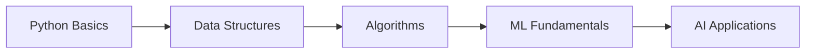
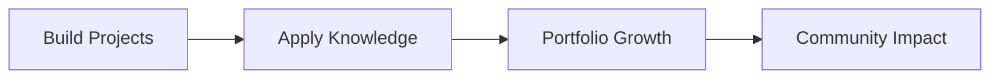

# <div align="center">👋 Building the Future with Code</div>

<div align="center">
  
### *"I don't just learn code... I build solutions that matter."*

[](https://git.io/typing-svg)

</div>

---

## 🚀 **Who Am I?**

```yaml
name: Noor Fatima
role: Aspiring Software Engineer
focus: ["Python", "Machine Learning", "Generative AI"]
philosophy: "Build > Talk | Learn by Doing | Community First"
current_status: Strengthening foundations. Building projects. Growing daily.
```

I'm a **passionate software engineer in the making** who believes in learning through building. My mission is to master the fundamentals of programming while creating meaningful solutions that contribute to the tech community.

---

## 💻 **Technical Skills**

<div align="center">

### **Languages & Technologies**


</div>

---

## 🧠 **Deep Focus Areas**

<table>
<tr>
<td align="center" width="33%">
  
### 🐍 **Python Fundamentals**
Mastering core programming concepts
  
</td>
<td align="center" width="33%">
  
### 🤖 **Machine Learning**
Building models that learn and adapt
  
</td>
<td align="center" width="33%">
  
### ✨ **Generative AI**
Exploring the future of intelligent systems
  
</td>
</tr>
</table>

---

## 🌱 **What I'm Working On**

<table>
<tr>
<td width="50%">

### 📚 **Learning Path**


**Currently focusing on:**
- ✅ Python fundamentals
- ✅ Software engineering best practices
- ✅ Problem-solving techniques

</td>
<td width="50%">

### 🚀 **Project Goals**


**Building towards:**
- 🎯 Meaningful project portfolio
- 🎯 Open-source contributions
- 🎯 Real-world problem solving

</td>
</tr>
</table>

---

## 🤝 **Collaboration Interests**

I'm always excited to work on projects that:

| Goal | Description |
|------|-------------|
| **📊 Create Impact** | Solutions that make a real difference |
| **🚀 Drive Growth** | Help me evolve as a developer |
| **🌍 Give Back** | Contribute to the open-source community |
| **💡 Solve Problems** | Address real-world challenges through code |

---

## 🎯 **Current Roadmap**

```diff
+ Deepen Python fundamentals & master best practices
+ Build a portfolio of meaningful projects
+ Start contributing to open-source repositories
+ Connect with & learn from the developer community
+ Explore ML & AI applications in real-world scenarios
```

---

## 💡 **My Philosophy**

<div align="center">

| Principle | Meaning |
|-----------|---------|
| **Build > Talk** | Ship code, not just ideas |
| **Learn by Doing** | Projects teach better than tutorials |
| **Community First** | Grow together, help others rise |

</div>

---

## 🌐 **Let's Connect**

<div align="center">

[](https://github.com/Noor-Fatima2408)
[](mailto:noor.202401938@gcuf.edu.pk)
[](https://linkedin.com)

</div>

---

<div align="center">

### ⚡ **"Strengthening foundations. Building projects. Growing daily."**

**If you're working on something meaningful, let's collaborate.**


</div>

---

<div align="center">
🔔 Follow for updates on my learning & building journey

*Last updated: May 2026*

</div>
